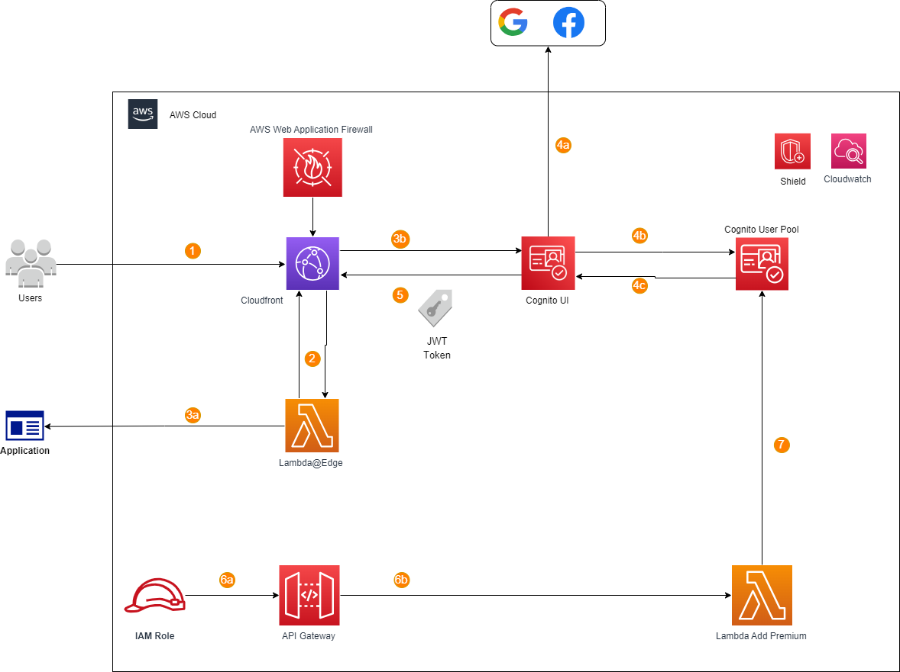

# Cloudfront Cognito Login


This pattern utilizes Cognito, Cloudfront, Lambda@Edge, WAF and S3 to implement a HostedUI login page for your web page. Users can login/sign-up using email, Google or Facebook and, upon login, are redirected to a website with a JWT token passed. This pattern also includes a Lambda based API behind API Gateway that can be used to add users to a premium user group. The entire stack can be deployed using CDK.

This is a typescript CDK application that creates:
* Amazon S3 bucket for static website hosting. Hosted behind Cloudfront
* Cognito Hosted UI and user pools for user data storage and authentication
* AWS Lambda function behind Amazon API Gateway for adding users to a premium user group
* AWS Lambda@Edge functions: OriginRequest and ViewerRequest to redirect users to login page if they are not already authenticated.

## Setup
Prereqs:
* Angular CLI https://angular.io/cli
* npm https://docs.npmjs.com/downloading-and-installing-node-js-and-npm
* CDK CLI https://docs.aws.amazon.com/cdk/v2/guide/getting_started.html

## Target Technology Stack and File Locations
### Infrastructure (Typescript)
Any infrastructure changes occur within the `cloudfront-cognito-stack/` directory. This creates:
* Hosted UI login page
* Cloudfront
* WAF and Shield

There is an additional stack within the `pre-cloudfront-cognito-stack/` directory that is used to deploy Secrets Manager prior to the main stack deployment. This is used if you would like support for Google and Facebook authentication.

### Lambda (ViewerRequest, OriginRequest and Premium_Lambda)
All lambda code can be found within `cloudfront-cognito-stack/lambda/` directory

### Example Static Website in S3 behind Cloudfront
This pattern includes an example Angular website just to highlight how an s3 website would be hosted behind AWS Cloudfront and to show how AWS Cognito Hosted UI can redirect to any domain of your choosing.

## How to Deploy

There are scripts provided for both Windows and Linux machines. To start the deployment process:
- run `chmod +x ./BuildAndDeploy.sh`

### Deploy the pre-stack (Secrets Manager)
There is a provided script called `BuildAndDeploy` for deploying the entire stack. To build and deploy, simply run `./BuildAndDeploy.sh all`. This make command will run `npm i` in all of the lambda directories to ensure their dependencies are present before deploying. It will also build the static site, built in angular, by running `ng build --configuration=production`. 

After building the project, the script will deploy an AWS Secrets Manager called `thirdPartyProviders`. This secret contains client credentials for Amazon Cognito to use to authenticate users with their Facebook or Google credentials. If you want this feature supported, you will need to generate client credentials with these providers and then update the secret values within AWS Secrets Manager. Instructions on how to generate credentials can be found here: https://docs.aws.amazon.com/cognito/latest/developerguide/cognito-user-pools-configuring-federation-with-social-idp.html

### Deploy the Main Stack
After you have updated the secret, the script should be waiting for your input. Go back to your terminal and enter `Y` and hit enter. The script will then take roughly 10 minutes to deploy the full solution.

### View HostedUI
Navigate to Cloudfront and grab the domain name listed next to your distribution. You should be redirected to a URL like: `https://example.auth.us-east-1.amazoncognito.com/login?response_type=code&client_id…` This is your hosted_UI and you can now begin signing up, logging in and checking JWT tokens!

### Add a Premium user
Once you have a user added to your User Pool, you can add that user to a premium user group via the premium lambda. To test this, navigate to API Gateway and click on the api titled `AddUsertoPremiumUserGroup` and you can create a test event. This api takes just 1 parameter, username. 
```
{
    "username" : "email@email.com"
}
```

## How to redirect to your own website
This solution includes an example angular static website, hosted in s3 behind cloudfront. The website code is stored under `cloudfront-cognito-stack/static-site`. If you want to use your own code, you need to do a few things:
* Within BuildAndDeploy scripts, edit the website path and any build commands needed.

* Within `cloudfront-cognito-stack/lib/InfrastructureStack.ts`, you will need to edit the `s3deploy.BucketDeployment` source to be where your website compiled code lives. There are comments within this file that specify how to do this.